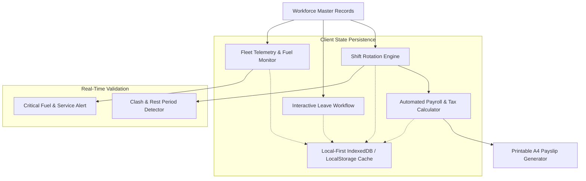

# ⚡ Nexus Corp & ShiftOps — Workforce ERP, 24/7 Shift Roster & Fleet Logistics OS

<p align="center">
  
  
  
  
  
  
</p>

> 🚀 **Live Production Application:** [https://olyxmintabansos-byte.github.io/nexus-shiftops/](https://olyxmintabansos-byte.github.io/nexus-shiftops/)

---

### 🌐 System Overview & Vision

**Nexus ShiftOps** adalah platform enterprise *Workforce Enterprise Resource Planning (ERP)* dan *Operations Logistics OS* yang dirancang untuk industri beroperasi tanpa henti (24/7 non-stop manufacturing, mining, hospital, server datacenter, and delivery fleet operations). 

Dibangun dengan arsitektur modern **Client-Side Local-First**, aplikasi ini memproses penjadwalan rotasi shift ribuan personel, deteksi bentrok jadwal otomatis (*clash detection*), simulasi payroll kompleks (PPh 21, BPJS, lembur dinamis), serta telemetri bahan bakar dan servis armada tanpa ketergantungan server runtime atau latensi jaringan.

---

### 🌟 Key Functional Pillars

#### 1. 📅 Weekly Shift Matrix (Gantt-Style Roster) (`/roster`)
- **24/7 Shift Multi-Tier:** Rotasi shift 3 periode (*Pagi 07:00–15:00*, *Siang 15:00–23:00*, *Malam 23:00–07:00*, dan *Off/Libur*).
- **Automated Clash Detection:** Validasi algoritmik instan yang mencegah dobel penugasan, pelanggaran batas maksimal jam kerja mingguan, atau jeda istirahat kurang dari 8 jam.
- **Visual Gantt Matrix:** Tampilan grid matriks karyawan vs hari dengan penanda warna shift interaktif dan drag/select intuitif.

#### 2. 👥 Employee Directory & Leave Approval Engine (`/employees`)
- **Master Data Karyawan:** Direktori komprehensif profil staf, departemen (Operations, Fleet Logistics, Tech & Engineering, Field Support), dan status kepegawaian.
- **Interaktif Leave Management:** Alur persetujuan permohonan cuti (Tahunan, Sakit, Melahirkan, Mendesak) dengan kalkulasi sisa saldo cuti dan status *Approved / Rejected / Pending*.

#### 3. 💵 Automated Payroll & Printable A4 Payslip (`/payroll`)
- **Formula Payroll Komprehensif:** Perhitungan gaji pokok, tunjangan shift malam, insentif kehadiran, serta tarif lembur berjenjang.
- **Kalkulasi Regulasi Indonesia:** Integrasi otomatis potongan BPJS Ketenagakerjaan (JKK, JKM, JHT, JP), BPJS Kesehatan, dan estimasi pajak PPh 21 TER.
- **Generator Slip Gaji Standar A4:** Ekspor slip gaji digital siap cetak format A4 resmi dengan nomor register, rincian *take-home pay*, dan kolom tanda tangan digital.

#### 4. 🚛 Operational Fleet Logistics & Fuel Telemetry (`/fleet`)
- **Real-Time Fleet Status:** Pemantauan status armada operasional (Tersedia, Bertugas, Dalam Perbaikan/Servis).
- **Fuel Level & Efficiency Monitor:** Telemetri kapasitas tangki, konsumsi liter/km, peringatan bensin kritis, dan riwayat pengisian BBM.
- **Log Pemeliharaan Berkala:** Peringatan jatuh tempo servis berkala, ganti oli, dan pergantian ban armada.

#### 5. 📊 Executive Operations Dashboard (`/`)
- **Real-Time KPI Cards:** Rasio kehadiran harian, tingkat keterisian shift (*roster fill rate*), akumulasi jam lembur bulanan, dan efisiensi konsumsi BBM.
- **Alert Banner Cepat:** Notifikasi otomatis anomali jadwal atau permohonan cuti yang membutuhkan tindakan manajerial segera.

---

### 🏗️ Architecture & Data Flow



---

### 📁 Directory Layout

```
nexus-shiftops/
├── public/
│   └── .nojekyll                 # Jekyll bypass for GitHub Pages
├── src/
│   ├── app/
│   │   ├── employees/page.tsx    # Employee directory & leave approval
│   │   ├── fleet/page.tsx        # Fleet monitoring & fuel telemetry
│   │   ├── payroll/page.tsx      # Payroll calculator & A4 payslip generator
│   │   ├── roster/page.tsx       # Weekly Gantt shift roster matrix
│   │   ├── layout.tsx            # Global layout, sidebar navigation, themes
│   │   └── page.tsx              # Executive KPI dashboard
│   ├── components/               # Modular UI widgets, modals & stats
│   ├── lib/                      # Business logic, shift calculators & formatting
│   └── types/                    # Strict TypeScript definitions
├── next.config.ts                # Static export configuration
└── package.json                  # Dependencies & scripts
```

---

### 🛠️ Technology Stack

| Domain | Technology / Library | Rationale |
|---|---|---|
| **Framework** | Next.js 16 (App Router) | Static export optimized for enterprise reliability |
| **Language** | TypeScript (Strict Mode) | Type-safe workforce and financial schema models |
| **Styling** | Tailwind CSS v4 | High-performance CSS-first zero-runtime utility styling |
| **Icons & UI** | Lucide React | Consistent, lightweight vector icon suite |
| **Persistence** | Local-First Storage | Offline-first zero-latency storage engine |
| **Deployment** | GitHub Pages (`gh-pages`) | Static hosting with `.nojekyll` bypass |

---

### 🚀 Getting Started & Local Development

Clone repositori dan jalankan pada local development environment:

```bash
# 1. Clone repository
git clone https://github.com/olyxmintabansos-byte/nexus-shiftops.git
cd nexus-shiftops

# 2. Install dependencies
npm install

# 3. Jalankan development server
npm run dev
```

Buka [http://localhost:3000](http://localhost:3000) pada browser Anda.

#### Build & Static Export

```bash
# Build static export ke direktori out/
npm run build

# Deploy langsung ke GitHub Pages branch gh-pages
npx --yes gh-pages -d out -b gh-pages --dotfiles
```

---

### 📄 License & Attribution

Didistribusikan di bawah lisensi MIT. Silakan gunakan untuk keperluan komersial maupun edukasi.

<p align="center">
  
  
</p>

<p align="center">
  <strong>© 2026 by Olyx (@olyxmintabansos-byte)</strong> • All rights reserved.
</p>
