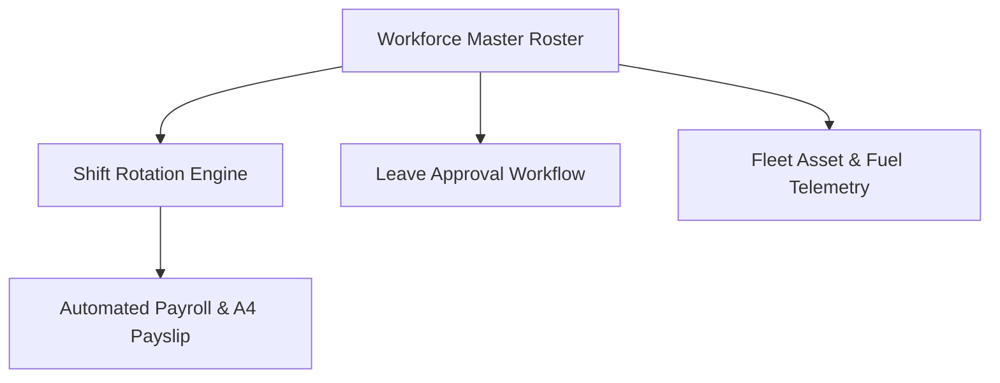

# ⚡ Nexus Corp & ShiftOps — Workforce ERP, Roster & Fleet OS

> **Live Demo:** [https://olyxmintabansos-byte.github.io/nexus-shiftops/](https://olyxmintabansos-byte.github.io/nexus-shiftops/)

Nexus ShiftOps adalah sistem ERP tenaga kerja komprehensif untuk operasi 24/7 yang mengintegrasikan matriks kalender shift mingguan Gantt, alur persetujuan cuti HRD, kalkulasi payroll & lembur otomatis (PPh 21/BPJS), serta monitoring armada kendaraan operasional real-time.

## 🚀 Fitur Utama
- **Weekly Shift Matrix (Gantt-Style):** Penjadwalan shift 24/7 (Pagi, Siang, Malam, Libur) dengan deteksi bentrok jadwal otomatis.
- **Manajemen Karyawan & Cuti:** Direktori karyawan, sisa jatah cuti, dan workflow persetujuan HRD interaktif.
- **Automated Payroll & Slip Gaji A4:** Perhitungan gaji pokok, tunjangan shift, lembur, potongan PPh 21, dan cetak slip gaji A4 siap tanda tangan.
- **Fleet & Vehicle Logistics (/fleet):** Monitoring aset armada operasional, status servis, kapasitas tangki, dan riwayat pengisian BBM.

## 🏗️ Diagram Arsitektur

